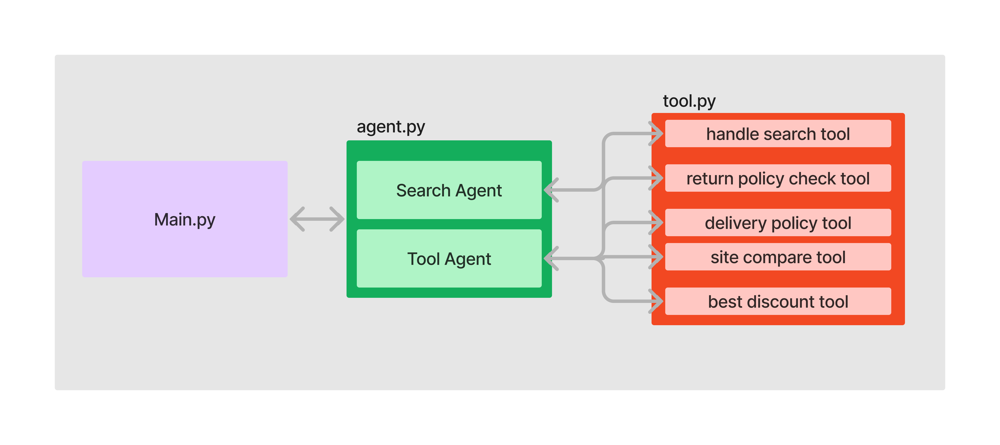

# E-commerce Search Application

This project is an E-commerce Search Application built using Streamlit.



## Features

- Search for products by name or category
- Filter products by price range
- Display product details including images, descriptions, and prices

## Installation

1. Clone the repository:
    ```bash
    git clone https://github.com/Hariharan-MageshAnand/llm_ecommerse_search.git
    ```
2. Navigate to the project directory:
    ```bash
    cd llm_ecommerse_search
    ```
3. Install the required dependencies:
    ```bash
    pip install -r requirements.txt
    ```
## Ollama Setup

1. Install Ollama:
        ```bash
        pip install ollama
        ```
2. Pull the llama3.2-vision model:
        ```
        ollama pull llama3.2-vision
        ```
## Usage

1. Run the Streamlit application:
    ```bash
    streamlit run main.py
    ```
2. Open your web browser and go to `http://localhost:8501` to access the application.

## Contributing

Contributions are welcome! Please open an issue or submit a pull request for any changes.


## Contact

For any questions or inquiries, please contact [cmhariharan8@outlook.com](mailto:cmhariharan8@outlook.com).
